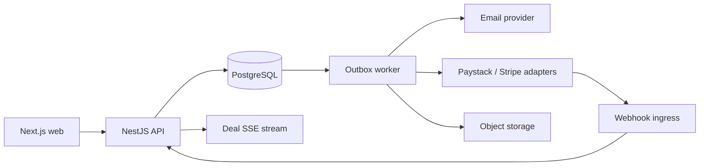

# DealOS system design

## 1. Product boundary

DealOS models the transaction infrastructure behind an acquisition marketplace. Public listing discovery is intentionally thin. The proof concentrates on the workflow where correctness matters most: an interested buyer enters a deal, signs an NDA, accesses sensitive documents, performs diligence, agrees terms, funds escrow, verifies asset transfer, and jointly signs off on release.

The public role description that motivated this prototype calls for a real-time deal pipeline, NDA-protected data rooms with audit logging, multi-currency escrow and automated release, AI-assisted due diligence, Node.js/PostgreSQL APIs, and secure authorization. Those are the core verticals implemented here.

## 2. Non-functional goals

The design assumes a path from a small team to 100,000+ active accounts without requiring a rewrite.

### Correctness

- Financial state must be monotonic and auditable.
- Retried requests must not duplicate funding or release.
- Data-room access must be denied by default.
- Legal workflow changes must preserve who did what, when, and from which state.
- State transitions must tolerate concurrent requests without lost updates.

### Availability

- Read-heavy dashboard and listing traffic can scale horizontally.
- Payment provider downtime must not corrupt local deal state.
- Notification failures must not roll back financial or legal state.
- Background side effects are retried from the outbox.

### Security

- Authentication and authorization are separate concerns.
- Authorization combines role membership with resource relationship.
- NDA access is evaluated at request time, not trusted from the client.
- Sensitive document URLs should be short-lived signed URLs in production.
- Payment card data never enters this system.
- Audit records are append only at the application layer.

### Observability

Every request should carry a request ID and every workflow command should carry a correlation ID. Logs are structured. Business metrics include transition failures, stale escrow cases, outbox lag, failed payment callbacks, denied data-room access, and provider latency.

## 3. Architecture decision: modular monolith first

A modular monolith is the right starting point because deal transitions, escrow state, NDA authorization, and audit history frequently participate in the same consistency boundary. Splitting them into services immediately would turn local transactions into distributed transactions and introduce failure modes without a demonstrated scaling requirement.

The modules are still isolated by interface:

- Identity and membership
- Listings and deals
- NDA and data room
- Due diligence
- Escrow and ledger
- KYC
- Audit
- Notifications and outbox

When one module develops a distinct scaling or compliance profile, its outbox events provide a clean extraction seam.

## 4. Runtime topology



Production extensions:

- CDN for static assets and public listing pages
- Redis for distributed rate limits and short-lived read caching
- S3-compatible object storage with KMS encryption for documents
- queue service when outbox throughput warrants independent workers
- OpenTelemetry traces into an APM backend

## 5. Core state machines

### Deal

```text
NDA_PENDING
  -> DILIGENCE
  -> LOI
  -> FULL_DILIGENCE
  -> SPA
  -> ESCROW
  -> ASSET_TRANSFER
  -> COMPLETED

Any pre-completion stage -> WITHDRAWN
```

A transition request includes `expectedVersion`. The update succeeds only when the persisted version matches. Conflicting writers receive HTTP 409 and must reload.

### Escrow

```text
CREATED -> FUNDING_PENDING -> FUNDED -> TRANSFER_IN_PROGRESS
        -> VERIFICATION -> RELEASE_PENDING -> RELEASED

FUNDED | TRANSFER_IN_PROGRESS | VERIFICATION -> DISPUTED
```

Release requires:

1. funded escrow balance
2. buyer sign-off
3. seller sign-off
4. platform confirmation
5. no open dispute
6. no previous release transaction

### KYC

```text
PENDING -> IN_REVIEW -> VERIFIED
                   -> REJECTED
                   -> NEEDS_INFORMATION
```

## 6. Money model

All amounts are stored as `BigInt` minor units plus ISO currency code. `25000000 USD` means USD 250,000.00 when currency exponent is two.

Escrow uses two concepts:

- `EscrowTransaction`: provider-facing business operation such as funding or release
- `LedgerEntry`: immutable accounting movement

A funded transaction produces balanced entries between external clearing and escrow liability accounts. A release produces balanced entries from escrow liability to seller payable and platform fee revenue.

This avoids deriving money state from mutable status fields alone.

## 7. Idempotency

Commands that can be retried accept an `Idempotency-Key`.

The database stores:

- scope
- key
- request hash
- result identifier
- terminal state

A duplicate key with the same request returns the original result. A duplicate key with a different request hash is rejected. This protects against browser retries, load balancer retries, provider webhook replay, and impatient users double-clicking.

Payment webhooks use the provider event ID as the idempotency key.

## 8. Transactional outbox

Domain changes and their corresponding outbox event are committed in the same PostgreSQL transaction. The worker claims pending outbox rows with `FOR UPDATE SKIP LOCKED`, publishes side effects, and records delivery.

This prevents the classic failure where the database commits but the process crashes before sending the notification or downstream message.

## 9. Data room authorization

A document request is allowed only when all of the following hold:

- requester participates in the deal or has platform-advisor permission
- document belongs to the listing connected to that deal
- buyer has an active signed NDA for that deal
- deal has not been withdrawn
- document is active

Every successful open and denied attempt may be recorded. In production, the API would return a short-lived signed object-storage URL instead of proxying bytes through the application server.

## 10. Audit trail

Audit entries are append only and include:

- actor
- organization
- deal/resource
- action
- previous state
- resulting state
- structured metadata
- correlation ID
- timestamp

Examples: NDA signed, document viewed, offer submitted, escrow funded, completion signed, release initiated.

The audit table is not the financial ledger. They serve different purposes and have different invariants.

## 11. Real-time updates

The prototype exposes a Server-Sent Events endpoint for a deal timeline. It polls new audit rows after the last delivered cursor and pushes events to connected clients.

At higher connection counts, the same contract can be backed by Redis Streams, NATS, or a managed pub/sub service while PostgreSQL remains the system of record.

## 12. Due-diligence engine

The demo uses deterministic rules so it remains reproducible without an AI provider:

- customer concentration above 30 percent
- month-over-month revenue decline
- material owner dependency
- missing IP assignment
- unresolved litigation marker
- weak recurring revenue

Each rule produces a severity, evidence payload, and suggested questions. An LLM can later enrich wording, but deterministic financial and legal checks should remain independently testable.

## 13. API surface

```text
GET    /health
GET    /deals
GET    /deals/:id
POST   /deals/:id/transition
POST   /deals/:id/nda/sign
GET    /deals/:id/events
GET    /data-room/deals/:dealId/documents
POST   /data-room/documents/:documentId/access
GET    /diligence/deals/:dealId
POST   /diligence/deals/:dealId/run
GET    /escrow/deals/:dealId
POST   /escrow/deals/:dealId/fund
POST   /escrow/deals/:dealId/sign-off
POST   /escrow/deals/:dealId/platform-confirm
POST   /escrow/deals/:dealId/release
GET    /kyc/me
```

## 14. Scaling path

### 0 to 10k active users

- single PostgreSQL primary
- 2 to 4 API replicas
- connection pooling
- CDN
- database outbox worker

### 10k to 100k active users

- PgBouncer or managed pooling
- read replica for analytics and non-critical dashboards
- Redis for rate limits and short TTL caches
- dedicated worker deployment
- object storage direct upload/download
- partition large audit tables by month when growth warrants it

### 100k+

Scale by measured bottleneck, not by fashion:

- extract payment/webhook processing if provider traffic and compliance ownership justify it
- move real-time fanout to pub/sub
- move search to a dedicated index
- isolate analytics from OLTP
- partition or archive append-heavy tables

The deal and ledger source of truth remains strongly consistent.

## 15. Failure modes deliberately addressed

| Failure | Protection |
| --- | --- |
| duplicate fund request | idempotency record + unique provider reference |
| two users transition same deal | optimistic version check |
| app crashes after DB commit | transactional outbox |
| provider sends webhook twice | provider event ID uniqueness |
| seller tries to access another listing | resource relationship authorization |
| buyer opens document before NDA | server-side NDA policy |
| money rounded incorrectly | integer minor units |
| release called twice | release transaction uniqueness + escrow state guard |
| notification provider unavailable | outbox retry, domain transaction still succeeds |
| long-running data-room link leaks | signed URL with short expiry in production |

## 16. Threat model summary

- IDOR: every resource lookup is scoped through participation and organization.
- Privilege escalation: roles are server-derived, never accepted from request payloads.
- Webhook forgery: production adapter verifies provider signatures before processing.
- Replay: idempotency on commands and webhook event IDs.
- Sensitive data leakage: private object storage, short-lived signed URLs, least-privilege service credentials.
- Audit tampering: no update/delete application endpoints; retention controls at the database role level.
- CSRF: production identity layer should use same-site secure cookies and CSRF protection for browser mutations.

## 17. What this prototype intentionally does not fake

- real card or bank funding
- storing KYC identity documents
- real legal signatures
- production escrow custody
- live LLM calls

Those integrations are represented by adapters and domain contracts. The important part of the showcase is the correctness of the surrounding application and transaction model.
